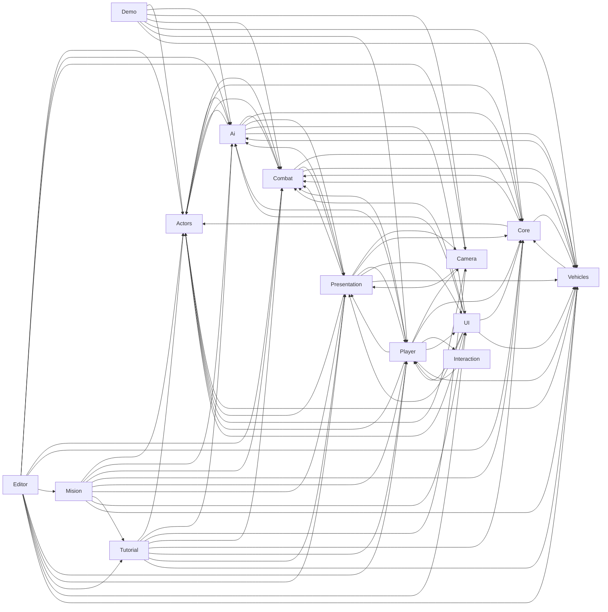

# Mapa de dependencias

> Derivado de los `using SP.*` de cada archivo. Un subsistema con muchos **entrantes** es caro de
> cambiar: tocarlo mueve a todos los que lo usan.

## Cuanto pesa cambiar cada subsistema

| Subsistema | Depende de | Lo usan | Sus dependencias |
|---|---|---|---|
| Actors | 3 | 12 | Ai, Combat, Core |
| Ai | 6 | 9 | Actors, Combat, Core, Presentation, UI, Vehicles |
| Camera | 2 | 5 | Actors, Presentation |
| Combat | 4 | 11 | Actors, Core, Presentation, Vehicles |
| Core | 3 | 11 | Actors, Combat, Vehicles |
| Demo | 7 | 0 | Actors, Ai, Camera, Combat, Core, Player, Vehicles |
| Editor | 11 | 0 | Actors, Ai, Camera, Combat, Core, Mision, Player, Presentation, Tutorial, UI, Vehicles |
| Interaction | 1 | 1 | Player |
| Mision | 9 | 1 | Actors, Ai, Combat, Core, Player, Presentation, Tutorial, UI, Vehicles |
| Player | 9 | 7 | Actors, Ai, Camera, Combat, Core, Interaction, Presentation, UI, Vehicles |
| Presentation | 8 | 8 | Actors, Ai, Camera, Combat, Core, Player, UI, Vehicles |
| Tutorial | 8 | 2 | Actors, Ai, Camera, Combat, Core, Player, Presentation, Vehicles |
| UI | 7 | 5 | Actors, Ai, Combat, Core, Player, Presentation, Vehicles |
| Vehicles | 4 | 10 | Actors, Ai, Combat, Core |

## Como leerlo

- **`Core` con muchos entrantes** es lo esperado: es la base sin escena.
- **`Presentation` y `UI` no deberian tener salientes hacia `Player` o `Ai`**: son capas de salida.
  Si aparecen, es acoplamiento al reves y vale revisarlo.
- **`Editor` puede depender de todo**; nada puede depender de `Editor`.
